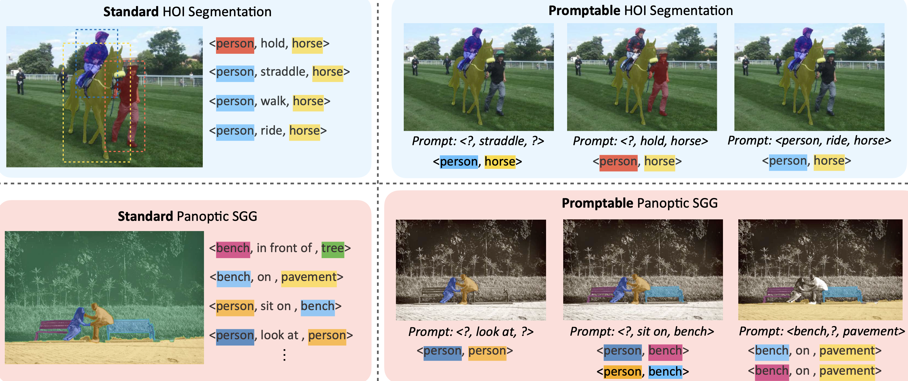

# FleVRS: Towards Flexible Visual Relationship Segmentation
### [Project Page](https://neu-vi.github.io/FleVRS/) | [Paper](https://arxiv.org/abs/2408.08305)

> FleVRS: Towards Flexible Visual Relationship Segmentation
> [Fangrui Zhu](https://fangruizhu.github.io/), [Jianwei Yang](https://jwyang.github.io/), [Huaizu Jiang](https://jianghz.me/)



## Citation

```bibtex
@inproceedings{zhu2024towards,
author      = {Zhu, Fangrui and Yang, Jianwei and Jiang, Huaizu},
title       = {Towards Flexible Visual Relationship Segmentation},
booktitle   = {NeurIPS},
year        = {2024}
}
```

## TODO List
- [x] Training and evaluation code.
- [ ] Preprocessed annotations on Huggingface.
- [ ] Model weights on Huggingface.
- [ ] Demo with SAM2.
<!-- - [ ] Interactive demo. -->

## Installation
Install the dependencies.
```
pip install -r requirements.txt
```

## Data preparation

### HICO-DET

HICO-DET dataset can be downloaded [here](https://drive.google.com/open?id=1QZcJmGVlF9f4h-XLWe9Gkmnmj2z1gSnk). After finishing downloading, unpack the tarball (`hico_20160224_det.tar.gz`) to the `data` directory.
Please download files [here](https://drive.google.com/drive/folders/1ua5q3mRg9sUYiPhXIXu1G-jEuJXu2W0X?usp=sharing) and mask version of the annotation [here](https://huggingface.co/datasets/fangruiz/HOI_dataset_masks/tree/main), and place them as follows.

```
data
 └─ hico_20160224_det
     |─ images
         |─ train2015
         |─ test2015
     |─ annotations
         |─ trainval_hico.json
         |─ test_hico.json
         |─ test_hico_w_sam_mask_merged.pkl
         |─ corre_hico_filtered_nointer.npy
         |─ exclude_test_filename.pkl
         |─ trainval_hico_samL_mask_filt
             |─ HICO_train2015_00018979.pkl
             :
```

### V-COCO

`train2014` and `val2014` are from COCO2014 dataset. 
Please download `corre_vcoco.npy`, `trainval_vcoco.json` and `test_vcoco.json` [here](https://drive.google.com/drive/folders/1Z11BRF4v95ZUZti97k7CuxkQLC7tJnOG?usp=sharing). And put them under `annotations` folder.

```
data
 └─ VCOCO
     |─ images
         |─ train2014
         └─ val2014
             |─ COCO_val2014_000000000042.jpg
             :
     |─ annotations
         |─ corre_vcoco.npy
         |─ trainval_vcoco.json
         |─ test_vcoco.json
         |─ test_vcoco_w_saml_mask_merged.pkl
         |─ trainval_vcoco_w_saml_mask
             |─ COCO_train2014_000000309744.pkl
             :

```

### PSG

Download `psg.json` [here](https://entuedu-my.sharepoint.com/personal/jingkang001_e_ntu_edu_sg/_layouts/15/onedrive.aspx?ga=1&id=%2Fpersonal%2Fjingkang001%5Fe%5Fntu%5Fedu%5Fsg%2FDocuments%2Fopenpsg%2Fdata%2Fpsg). 

The following files are needed for PSG.

```
data
  ├── coco
  │   ├── panoptic_train2017
  │   ├── panoptic_val2017
  │   ├── train2017
  │   └── val2017
  └── psg
      └── psg.json

```

## Training

### Pretrained weights

Download the pretrained weights `xdec_weights_focall.pth` [here](https://drive.google.com/drive/folders/1oR3zj3Rqei88nxfqtwnM06guEY9QWQOt?usp=sharing). Create a folder `params` and put the file under it.

### Scripts

Please check scripts under ``configs/`` for details.

```
 sh configs/standard/train_standard_hico+vcoco+psg_focall.sh
 sh configs/standard/train_focall_standard_hico.sh
 sh configs/standard/train_standard_psg.sh
 ...
```


## Evaluation
Please check scripts under ``configs/`` for details.
```
sh configs/standard/test_hico.sh
...
```

## Acknowledgments

Our code is based on [X-Decoder](https://github.com/microsoft/X-Decoder).  
We also thank the following works:
[HiLo](https://github.com/franciszzj/HiLo), [CDN](https://github.com/YueLiao/CDN/tree/main), [Mask2Former](https://github.com/facebookresearch/Mask2Former)

## License
This code is distributed under an [MIT LICENSE](LICENSE).  
Note that our code depends on other libraries, including CLIP, Transformers, FocalNet, PyTorch, and uses datasets that each have their own respective licenses that must also be followed.

